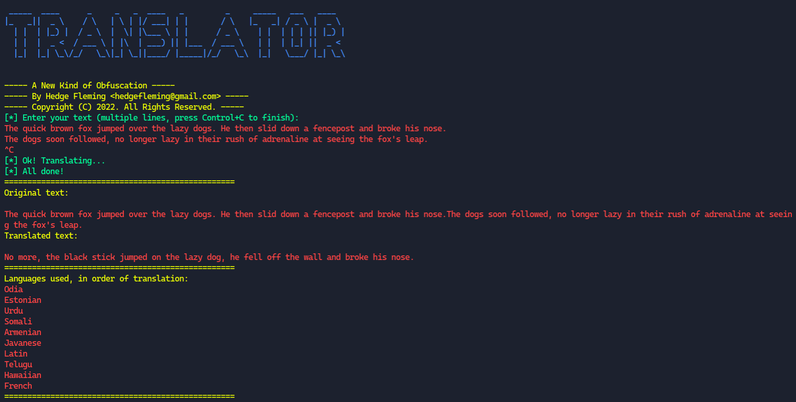

# Translator: A New Kind of Obfuscation

Translator is a simple Python script that takes your input text, runs it through 10 (by default) different languages with Google Translate, and then spits out the final result converted back into English. It's a mostly useless, yet amusing, program. Here's a screenshot:

